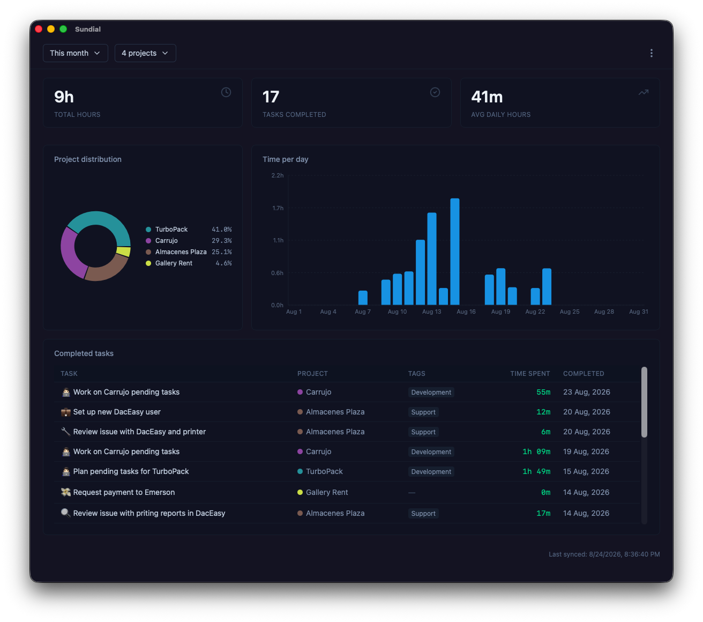

# Sundial

[](LICENSE)
[](https://github.com/ypk46/sp-sundial/actions/workflows/ci.yml)
[](https://github.com/ypk46/sp-sundial/releases)

A native desktop dashboard for visualizing time-tracking data from [Super Productivity](https://github.com/johannesjo/super-productivity).

Sundial syncs time-tracking data from Super Productivity's local REST API on demand, then serves analytics views from local persistence — no live API dependency for browsing.

**Platforms:** macOS (Apple Silicon & Intel) · Windows · Linux

## Download

Pre-built binaries are available on the [Releases page](https://github.com/ypk46/sp-sundial/releases/latest).

> **Note:** Builds are currently unsigned. On macOS, right-click the app → **Open** to bypass Gatekeeper, or run `xattr -d com.apple.quarantine /path/to/Sundial.app`. On Windows, click **More info → Run anyway** past SmartScreen. See [SECURITY.md](SECURITY.md) for details.

## Features

- **Time spent per day** — charts across a custom date range
- **Distribution by project** — stacked bars showing project breakdown
- **Date range filtering** — custom date picker + presets ("This Week", "This Month", etc.)
- **Project filtering** — multi-select to include/exclude projects
- **Expandable per-day task lists** — drill into which tasks contributed time on any given day
- **Offline browsing** — after a sync, all views work from local storage without the API

<!-- Screenshots/GIFs: add after first stable release -->



## Tech Stack

- **Tauri v2** — native desktop app, Rust backend, system webview (~5 MB bundle)
- **React 18 + TypeScript** — frontend
- **Vite** — build tooling
- **Dexie.js (IndexedDB)** — local persistence for synced data

## Prerequisites

- [Rust](https://rustup.rs/) (installed via rustup)
- Node.js 24 (see [.nvmrc](.nvmrc))
- Xcode CLI tools: `xcode-select --install`
- [Super Productivity](https://github.com/johannesjo/super-productivity) desktop app running with the local REST API enabled (Settings → Miscellaneous → Enable local REST API)

## Getting Started

```bash
# Install dependencies
npm install

# Run in development (opens a native window with hot reload)
npm run tauri dev

# Build a production bundle
npm run tauri build
```

The built app appears at `src-tauri/target/release/bundle/`.

## How It Works

1. Sundial asks for the REST API token on first startup.
2. On sync, the Rust backend fetches tasks, projects, and tags from `127.0.0.1:3876` (the Super Productivity local REST API).
3. The frontend normalizes the data and writes it to IndexedDB (full replace, not delta merge).
4. All charts and views render from IndexedDB. The API is only contacted on sync.

**Requirements for syncing:**

- Super Productivity (Electron desktop app) must be running
- The local REST API must be enabled: Super Productivity → Settings → Miscellaneous → Enable local REST API

## Feedback & Issues

Feedback and bug reports are welcome via [GitHub Issues](https://github.com/ypk46/sp-sundial/issues). Please see [CONTRIBUTING.md](CONTRIBUTING.md) for how to report them. Pull requests are not accepted — this is a solo-maintained project.

## License

[MIT](LICENSE)
